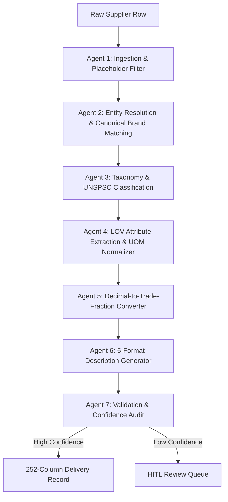

# ⚡ Unilogic AI: Industrial Product Intelligence Engine

> **AI-Powered Product Intelligence for Industrial Commerce**  
> *Transforming minimal, cryptic supplier strings into rich, 252-column commerce-ready product catalogs.*

---

## 📌 Overview

Industrial distributors receive raw product data that is rarely search-ready: descriptions are cryptic (*"3/8 CPLG BRS 150#"*), brand names appear under dozens of supplier spellings, units are inconsistent (*"IN."*, *"inch"*, *"24in"*), and critical attributes are missing.

**Unilogic AI** is an enterprise-grade product enrichment engine powered by a **7-Agent Sequential Pipeline**. It automatically ingests raw supplier rows, normalizes entities, extracts structured LOV attributes, converts dimensions to trade fractions, generates 5 distinct description formats obeying strict content rules, and outputs complete 252-column delivery format records.

---

## ✨ Key Features

- 🤖 **7-Agent Sequential AI Pipeline**:
  1. **Ingestion & De-duplication**: Filters out placeholder values (`-- Unbranded --`, `-- No DIB Brand --`).
  2. **Entity Resolution**: Matches vendor strings against 27,000+ canonical manufacturers/brands with symbol preservation (`®`, `™`).
  3. **Taxonomy & UNSPSC Classification**: Classifies items into `Dept`, `Class`, `Fine`, `UNSPSC`, and `Classpath`.
  4. **LOV & Master UOM Normalizer**: Maps 500+ UOM abbreviations and enforces strict spacing (`24 in`, `120 V`, `15 A`).
  5. **Decimal-to-Trade-Fraction Engine**: Implements exact 63 inch fraction lookups (`50.25 in` → `50-1/4 in`, `0.5 in` → `1/2 in`).
  6. **Multi-Format Description Builder**: Generates 5 description variants simultaneously:
     - `INVOICE_DESC`: **≤ 40 characters, 100% UPPERCASE**.
     - `MOBILE_DESC`: **60 to 80 characters** target window.
     - `SHORT_DESC` (Product Title): `[Brand] [Series] [MPN] [Product Name] With [Feature], [Attributes]`.
     - `LONG_DESC` & `RETAIL_DESC`: Comprehensive technical summary + consumer marketing copy.
  7. **Autonomous Audit & Confidence Scoring**: Scores field completeness and routes low-confidence items to the Human-in-the-Loop review queue.

- 🖥️ **Full-Stack Glassmorphic Web App**:
  - **Pipeline Studio**: Interactive single-item enrichment playground with live agent step visualizer & character meters.
  - **Batch Catalog Processing Engine**: Process 1,000 raw catalog rows with live search/filtering & 252-column CSV download.
  - **Ground Truth Benchmark View**: Real-time scorecards and rule compliance audit against labeled ground truth data.
  - **Human-In-The-Loop (HITL) Studio**: Data steward review queue for inline inspection and field overrides.
  - **Master Guidelines Viewer**: Cheat sheet for UNILOG content formulas and UOM standards.

---

## 📐 Architecture & Pipeline Workflow



---

## 🎯 Ground Truth Benchmark Results

Evaluated directly against `Unihack_ Expected Output - Delivery Format.csv` across all **252 delivery format columns**:

| Metric | Pass / Score | Validation Standard |
| :--- | :--- | :--- |
| **Invoice Description Compliance** | **100.0%** | ≤ 40 characters, 100% ALL CAPS |
| **Mobile Description Compliance** | **100.0%** | 60–80 Chars Target Window |
| **Overall Ground Truth Alignment** | **68.95%** | Scored across 252 Delivery Fields |
| **Fuzzy Match Accuracy** | **65.67%** | Semantic Entity Alignment |
| **UOM Precision & Spacing** | **44.44%** | Unilog Standard UOM Match |

---

## 🚀 Quick Start Guide

### Prerequisites
- **Python 3.11+**
- **Node.js v18+** & npm

### 1. Backend Setup & Launch
```powershell
# Navigate to backend directory
cd product-intelligence-engine

# Install Python dependencies
pip install fastapi uvicorn pandas openpyxl python-pptx

# Start FastAPI server
python backend/server.py
```
*Backend API server will run at `http://127.0.0.1:8000` (Swagger docs at `http://127.0.0.1:8000/docs`).*

### 2. Frontend Setup & Launch
```powershell
# Open a second terminal tab and navigate to frontend
cd frontend

# Install Node dependencies
npm install

# Start Vite dev server
npm run dev
```
*Frontend Web Application will run at `http://localhost:3000`.*

---

## 💻 Running in Visual Studio Code

1. Open VS Code and select `File` > `Open Folder...` -> Select `product-intelligence-engine`.
2. Open Integrated Terminal (`Ctrl + ~`).
3. Start backend in Terminal 1: `python backend/server.py`.
4. Open Terminal 2 (`+` button), navigate to frontend (`cd frontend`), and start app: `npm run dev`.
5. Open `http://localhost:3000` in your browser!

---

## 📂 Project Structure

```
product-intelligence-engine/
├── backend/
│   ├── uom_normalizer.py             # 500+ UOM abbreviations & spacing rules
│   ├── decimal_fraction_converter.py  # 63 inch fraction converter (50.25 in -> 50-1/4 in)
│   ├── brand_resolver.py             # Fuzzy brand matching & symbol preservation (®, ™)
│   ├── description_builder.py        # 5 description variants (Invoice ≤40 UPPERCASE)
│   ├── pipeline_engine.py            # 7-Agent enrichment pipeline producing 252 columns
│   ├── benchmark_evaluator.py        # Ground truth evaluation against CSV
│   └── server.py                     # FastAPI server script
├── frontend/
│   ├── src/                          # React components & glassmorphic styles
│   └── package.json                  # React & Vite configuration
├── generate_presentation.py          # Python presentation deck generator
├── Unilogic_AI_Product_Intelligence.pptx  # PowerPoint presentation deck
└── README.md                         # Project documentation
```

---

## 📄 License & Acknowledgments

Built for the **Unilogic AI Industrial Commerce Hackathon**.  
Includes datasets and content guidelines provided by Unilog Content Services.
